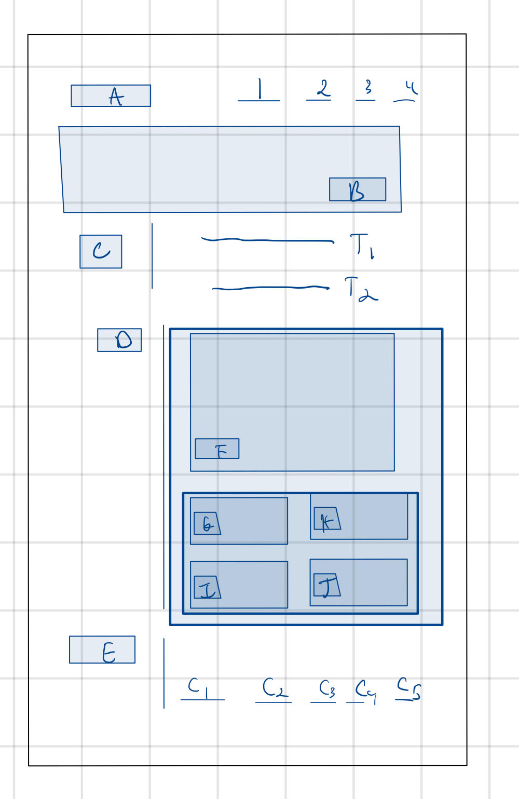
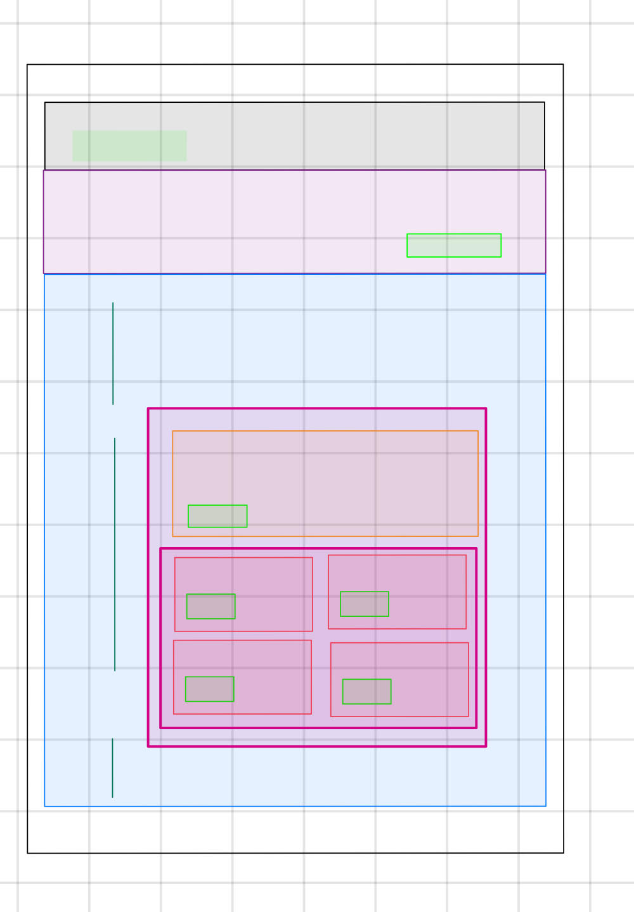
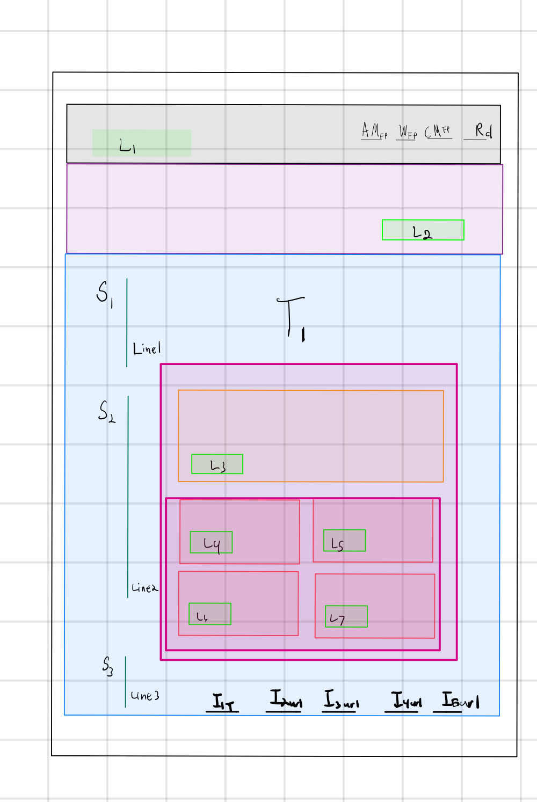
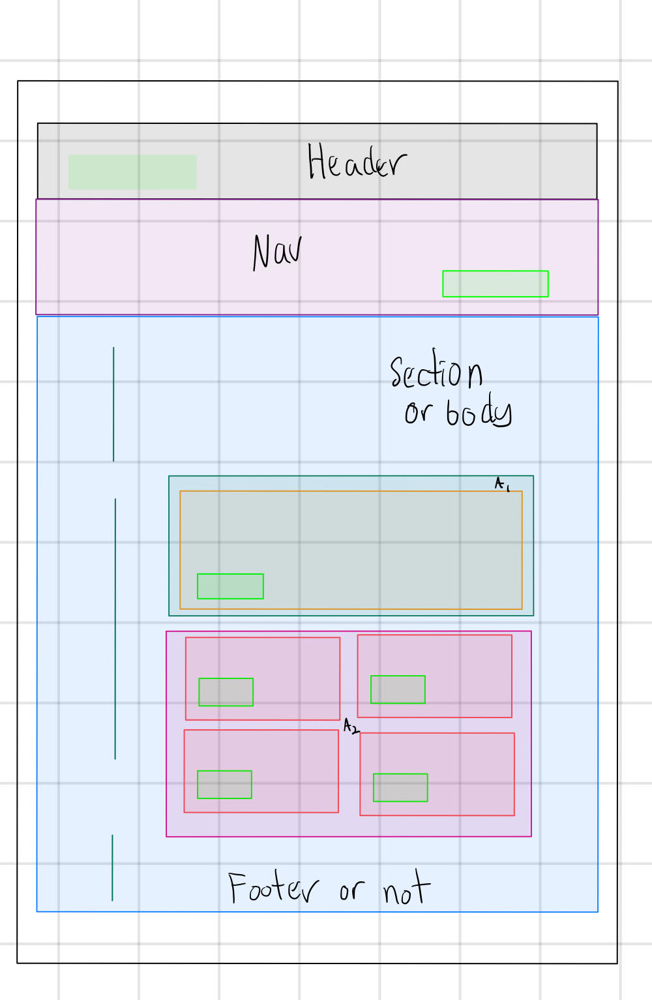
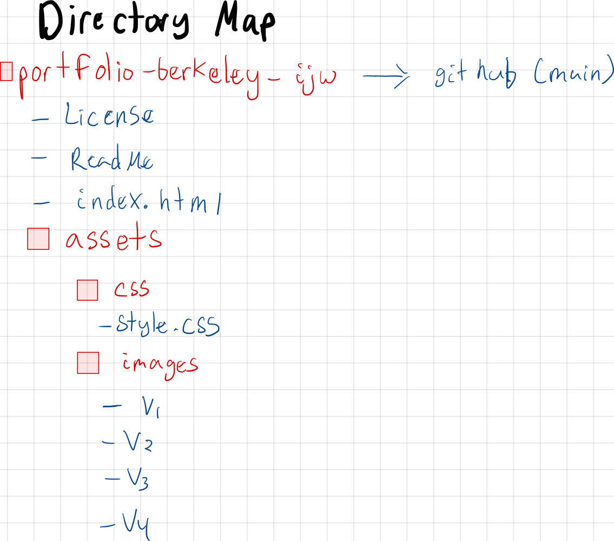

# portfolio-berkeley-ijw

# Markup

##Version 1 - 

## How can I create a rough sketch using a GIF?

What I am doing here is just getting a rough sketch of the website based on where the images are and where the boxes are. I tried to be tough to get this on a GIF. However I I am creating multiple mark ups so that I can use this to better understand what goes where.

## Version 2 - 

Question 2: Where are the boxes are going to be?

In this image I use the gift in the previous mark up to get a better sense of where the boxes are. I color-coded it based on what I think that would be similar, while ignoring where text would be.

## Version 3 - 

Question 3: Where is the info located?

Since the header URLs are going to be pointing to information on the website and the contact information is going to be linked to information off the website and finally the images are going to be linked to material that is on the website. It is important that we make that designation in the actual Website

- AM_{FP}: About me - Front Page
- W_{FP}: Work - Front Page
- CM_{FP}: Contact Me - Front Page
- R_{D}: Resume - Front Page

- L_1: Label 1 in header name of Portfolio
- L_2: Label 2 in nav sub name 
- L_3: Label 3 of main work
- L_4: Label 4 project 1
- L_5: Label 4 project 2
- L_6: Label 4 project 3
- L_7: Label 4 project 4

- T_1: Text

- S_1: About Me with Line 1
- S_2: Work with Line 2
- S_3: Contact Me with Line 3

- I_{1T}:  information phone number text
- I_{2url}:  information email url
- I_{3url}:  information GitHub url
- I_{4url}:  information Business Website url
- I_{5url}:  information LinkedIn

## Version 4 - 

Question 4: What type of tags will be used?

Answer 4: This image is actually very important because it allows me to figure out what tags are going to be needed within the HTML file before actually programming. I change my mind in terms of the article regarding the projects in the main projects so I decided to split them up into A,: Article 1, with 1 image

-A1: Article 1

-A2: Article 2

# $$\textcolor{red}{START HERE}$$
## Code Forseeing
Question 5: What is the idela directory structure?
Answer 5: Below demonstrates the current thought process

What are the regions in wbesite?

# Process of Programming
Repeat Process
- Select top most region
- Develop HTML with semanatics and comments
- Develop CSS
  - hovertip
